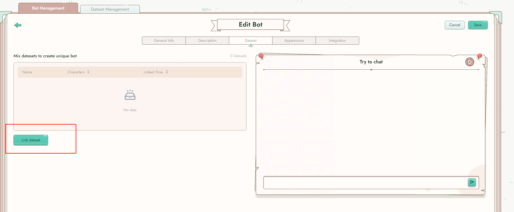
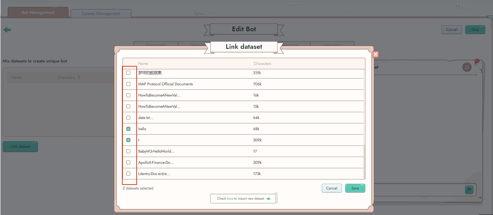

# Create bot

## **Quick Start**

1. Create your first bot!
2. Think about the type of bot you want to create, such as an expert in a specific domain, a movie character, or a champion.
3. Click on "Create bot" in the navigation bar to start the creation process.
4. Fill out the required fields, including name, language, response type, and a short public description.

**Field 1: Name**

Choose a name for your bot that will be used in chat and help others discover it.

**Field 2: Language**

Select the language for the bot chatting page display. This setting also applies when integrating the bot with other channels.

**Field 3: Response Type**

Specify the type of responses your bot will provide to users.

**Field 4: Introduction**

Write a brief introduction that users will see on your bot's name card.

**Field 5: Public to Reiki**

Decide whether your bot should be visible to everyone. If set to public, others can discover and chat with your bot. Also, you need to select a category or add tags to your bot.

<figure><figcaption></figcaption></figure>

***

## **More Settings**

The basic settings of the bot are complete, but there are still more settings available to take your bot customization to the next level. Click any button you're interested in and elevate your bot customization.

<figure><figcaption></figcaption></figure>

### **Description**

#### Field 1: Greeting

The greeting is the the initial sentence through which your bot interacts with users. It contributes to the bot's unique characteristics.

**Field 2: Backstory**

Provide a more detailed description of the bot's background, story, personality, hobbies, and more.

<figure><figcaption></figcaption></figure>

### **Dataset**

Connect the dataset from your data repository to empower the bot with knowledge. Once this data is parsed, the bot will become knowledgeable and capable of answering questions based on the provided information.

<figure><figcaption></figcaption></figure>

<figure><figcaption></figcaption></figure>

###

### **Appearance**

Explore various combinations of body shape, color, and emotions to create the desired appearance for your bot.

<figure><figcaption></figcaption></figure>

### **Integration**

You bot can be deployed across multiple platforms. With multiple deployment channels, seamlessly integrate your bot into websites, Discord, and other platforms to support your projects and assist your customers.

#### Website bubble

To incorporate a bubble onto your website, copy and paste the provided code into the HTML head section of your webpage. This will add a bubble to your website interface.

####

#### Discord

To on board your bot to discord server, please check [tutorial ](https://web3go.notion.site/Onboard-your-bot-to-Discord-server-049fb2762ea44852b4745c34831f8da8?pvs=25)here.

#### API Integraton:

To on board your bot through API, please check [tutorial](deployment-service/api.md) here.

### Try to Chat

In the "Try to Chat" section, you can test your bot's settings. Whenever you make changes to your bot's settings, you can chat with the bot to see how the changes will be applied.

## Advanced Settings

Stay tuned for more advanced settings coming soon.
