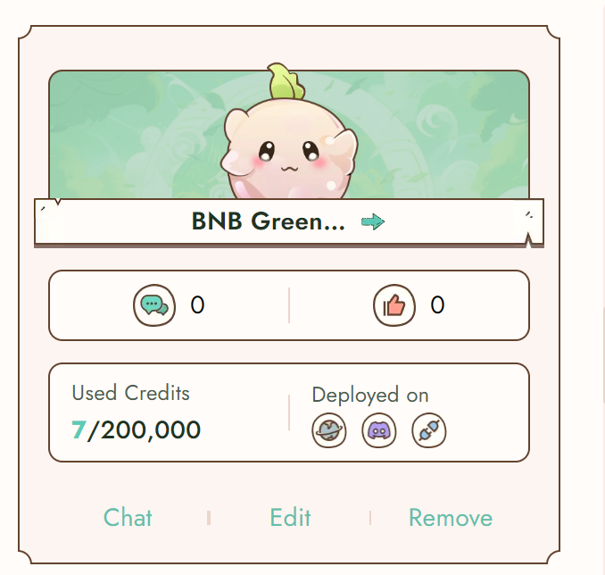

# Deployment Service

### What is Credit?

Reiki calculates credits based on the input and output of each bot's deployed channels.  Each bot has a credit limit of 200,000 for all conversations across all deployed channels. However, there is no limit on Reiki's platform. \
\
This means that on all channels, the total credits used by user messages and bot responses combined cannot exceed 200,000. For instance, if you deploy your bot to both a website and a Discord server, they would share the 200,000 credit limit.

Normally, each character is counted as one credit in GPT-3.5. Longer inputs and outputs will consume more credits accordingly. Additionally, the number of credits consumed may vary depending on the specific models you choose.&#x20;

Currently, the credits are renewed every 30 days, starting from the first day of your bot's creation date. This means that each bot may renew on a different date. You'll be able to see your available credit once you enter Bot Lab.\

<figure><figcaption></figcaption></figure>

### **Integration**

You bot can be deployed across multiple platforms. With multiple deployment channels, seamlessly integrate your bot into websites, Discord, and other platforms to support your projects and assist your customers.

#### Website bubble

To incorporate a bubble onto your website, copy and paste the provided code into the HTML head section of your webpage. This will add a bubble to your website interface.

####

#### Discord

To on board your bot to discord server, please check [tutorial ](./#discord)here.

#### API Integraton:

To on board your bot using API, please check [tutorial ](api.md)here.
