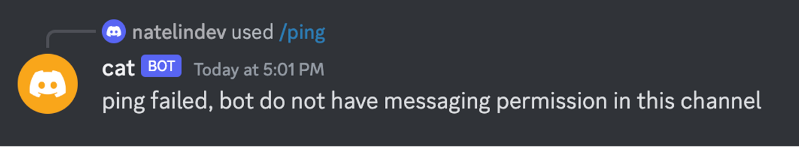

# Discord

## Onboard your bot to Discord server

💁🏼 If you encounter any issues while using it, please join our Discord community to ask for assistance.

&#x20;📌 When renaming the bot, please follow [Discord's naming rules](https://discord.com/developers/docs/resources/user).

### **Prerequisites**

* Obtain an API key from the API Intergation section.

<figure><figcaption></figcaption></figure>

### **Configuration**

1. Switch to the Integration tab and locate "Deploy to Discord". Next, click on "Deploy to a new server".

<figure><figcaption></figcaption></figure>

2. Select the server you want to add.

<figure><figcaption></figcaption></figure>

3. After adding the bot to your discord server, you should be able to find the command `set_api_key` by typing slash key `/`.

<figure><figcaption></figcaption></figure>

4. Press `enter` key and paste your API key in the prompted input box. The bot should respond with `discord bot api key updated` .

<figure><figcaption></figcaption></figure>

5. Add channel list where the bot can be active. typing slash key `/` again and find the command `add_allowed_channel`

6. Click on `target_channel` to select the channel you want to add, if no channel was selected, this command will add the current channel you are using to allowed channel list.

<figure><figcaption></figcaption></figure>


&#x20;**IMPORTANT:** Ensure that the Discord administrator grants the Bot sufficient permissions, enabling it to speak in the appropriate channel. This step is crucial for the Bot to function effectively.


### Test Permission

Use `ping` command in a channel to test if bot can respond with `pong`, if not, the bot will raise an error like, then you should check the bot’s permission again.

<figure><figcaption></figcaption></figure>

**Talking to Bot**

Simply use `@` to mention the bot along with your message in previously added channel, then the bot will create a thread and respond to your questions. You can also reply to the bot in the same thread to keep the conversation going.

###

### **Command Explaination**

There are other commands you can use to configure the bot

* `set_name` change the nick name of bot in your server
* `ping` the bot should respond with “pong”, can be used to test if bot have message permission in this channel, if not, the bot would respond with an error message
* `add_admin_user` by default only members with `manage server` permission in your server (this includes server owner, admins and those who were explicitly granted this permission) can manage the bot you’ve added. You can add additional members using this command.
* `remove_admin_user` the opposite of `add_admin_user`
* `remove_allowed_channel` the opposite of `add_allowed_channel`
* `refresh_commands` bot may support additional commands in the future, to make sure you have the latest commands in your server, you can use this command to fetch the latest list of commands available.
