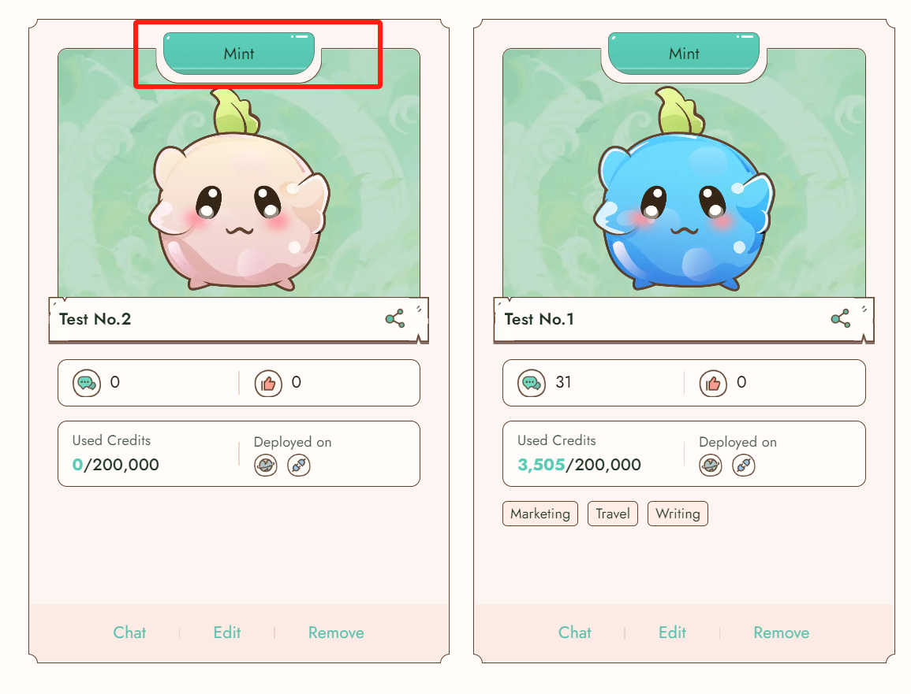
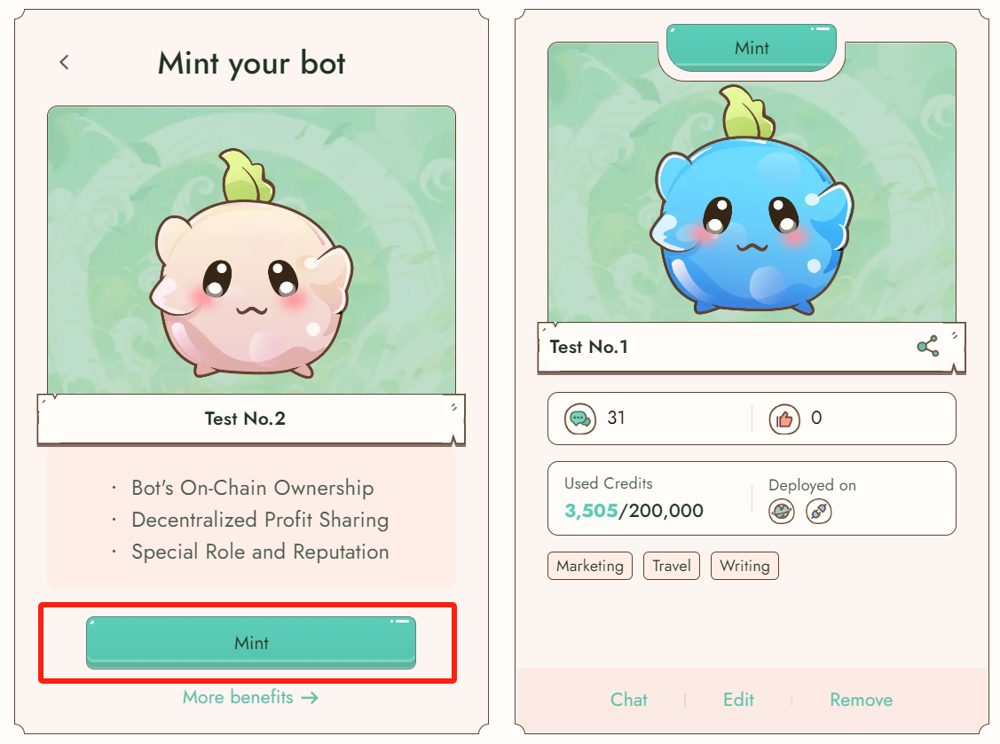
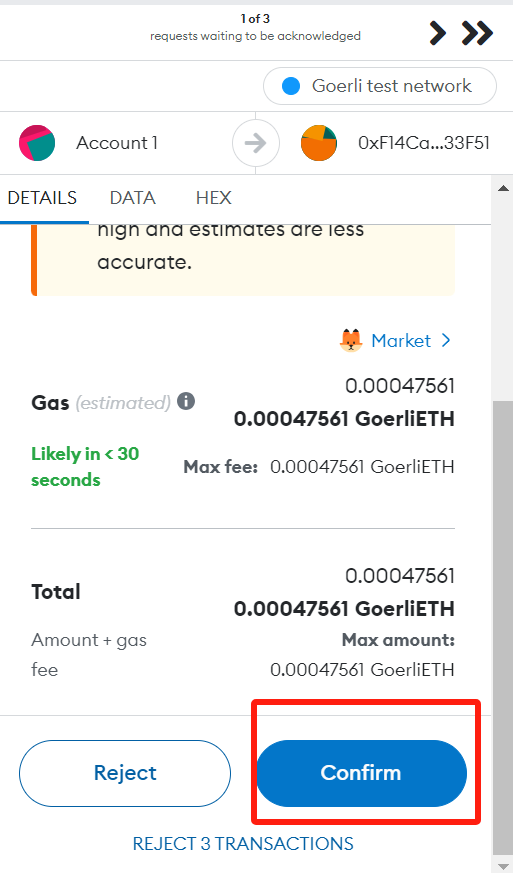
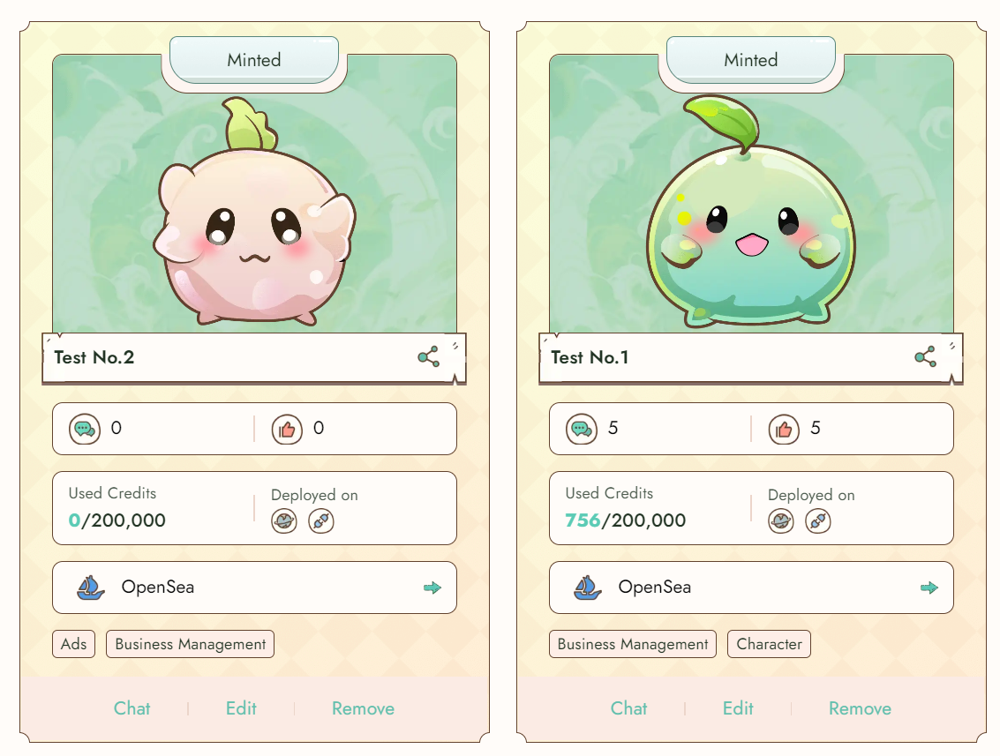

# Mint bot

#### Why we mint bot

Reiki is set to revolutionize the world of AI by introducing Bot NFT, a groundbreaking concept that brings your bot onto the blockchain. But why is onchain integration the next big leap?

First and foremost, on-chain ownership takes center stage. By transforming your bot into an AI-native digital asset, you gain true ownership on the blockchain. This encompasses all fundamental settings and interaction statistics, providing an unparalleled level of control and authenticity.

The benefits extend further with decentralized profit sharing. As your bot evolves into a valuable NFT, you reap the rewards of its increasing price, transactions, staking, and other on-chain activities. This dynamic ecosystem ensures that your financial success aligns with the growing value of your bot.

Within the Reiki community, you assume the role of an on-chain AI asset owner, earning recognition as a genuine AI Key Opinion Leader (KOL) backed by proof of monetization. This distinction opens doors to exclusive privileges, including early access to new bot features, enabling you to stay at the forefront of AI innovation

Reiki's commitment to continuous improvement is evident through the development of a composable and scalable NFT contract. Upgrades and surprises from the contract ensure that your bot remains adaptable and future-proof, catering to your evolving AI needs.

Lastly, the integration of NFTs into Reiki's tokenomics ecosystem solidifies their importance. These digital assets become an integral part of the broader Reiki ecosystem, enhancing its value and utility. The harmonious interplay between NFTs and tokenomics drives innovation and growth within the Reiki community.\

Take the leap and bring your bot on-chain today!\

#### How to Mint

To get started, create a public bot. Once you've done that, you'll notice a mint button at the top. Simply click on it, and the card will flip over.&#x20;

<figure><figcaption></figcaption></figure>

Proceed by clicking the Mint button and approving the transaction.&#x20;

<figure><figcaption></figcaption></figure>

\
\

Congratulations! You'll now receive a minted bot.

<figure><figcaption></figcaption></figure>

