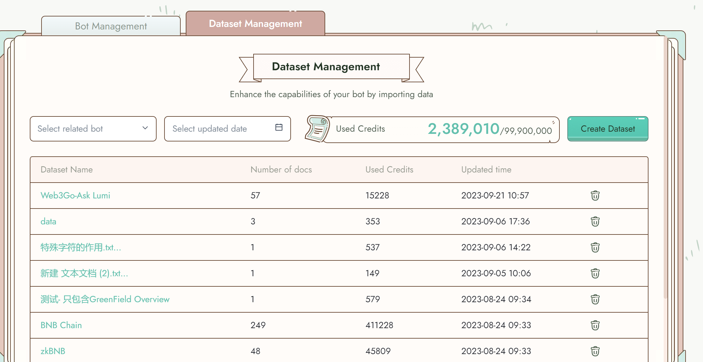
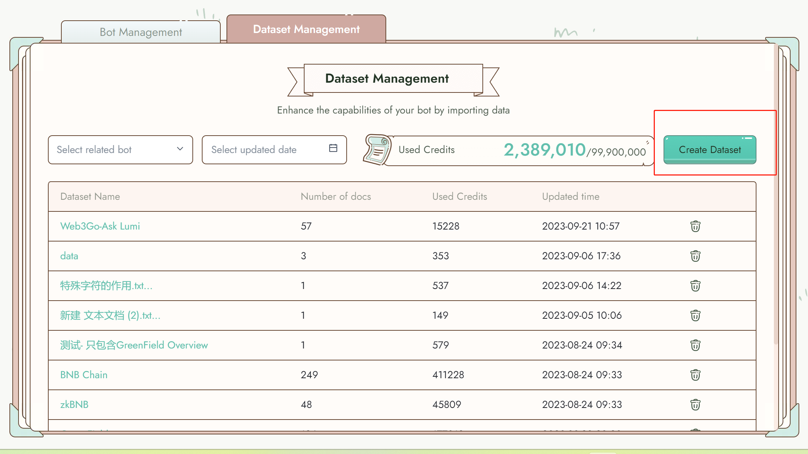
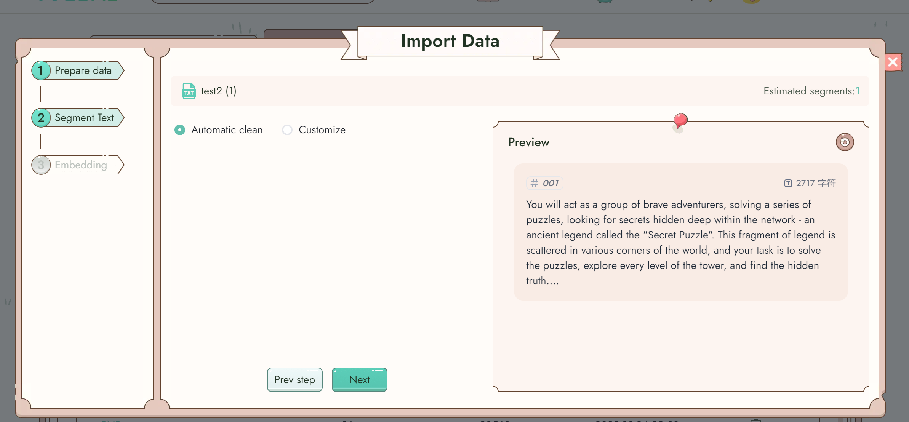
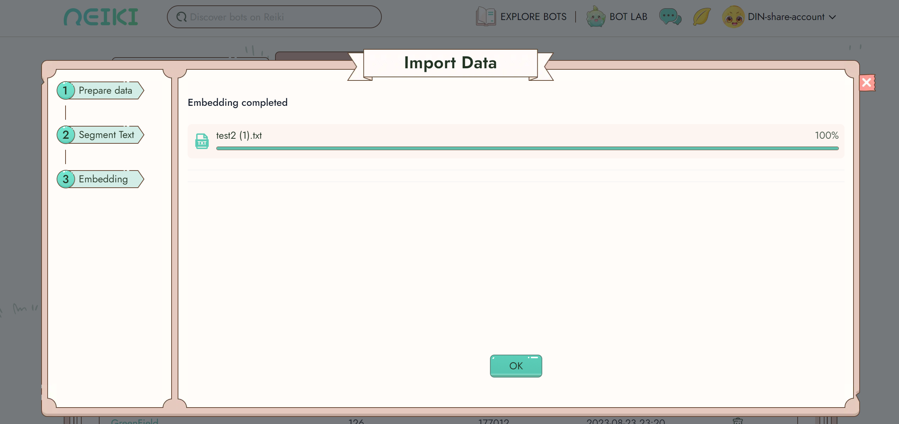
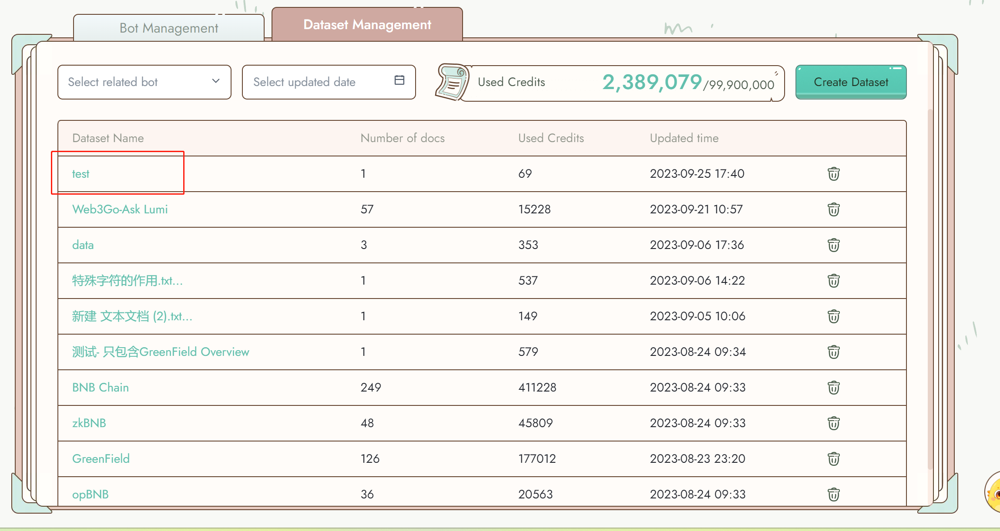

# Dataset Management

The Dataset Management section provides you with the tools to handle and organize the data used by your bots. Here, you can create and manage data, as well as monitor your data usage. This functionality enables your bots to effectively utilize and understand external data, leading to improved performance and reliability.

#### What is Character?

Currently, you can upload up to 800,000 characters of data. Each dataset can be linked to different bots.

On the page, you can easily view your current usage and limitations.

Once you attach your document(s) for upload, Reiki will display the character count of all the attached documents.

<figure><figcaption></figcaption></figure>

<figure><figcaption></figcaption></figure>

#### Manage your dataset

When creating a dataset, you can combine multiple files.&#x20;

Start by naming your dataset and uploading one or more files.

<figure><figcaption></figcaption></figure>

<figure><figcaption></figcaption></figure>

The following file formats are currently supported: txt, html, markdown, xlsx, and pdf. Each file can be a maximum of 15MB in size.

Once a file is uploaded, you have the option to automatically segment the data or manually segment it to improve the bot's understanding.

<figure><figcaption></figcaption></figure>

<figure><figcaption></figcaption></figure>

After the embedding and indexing process, your dataset will be ready for the bot to learn from. Observe how the bot's behavior changes based on the new data!

<figure><figcaption></figcaption></figure>

#### Manage your data

You can easily manage your data under each dataset. Edit or delete the data as needed. If you're unsatisfied with the data, click the edit button to re-segment it.

<figure><figcaption></figcaption></figure>
