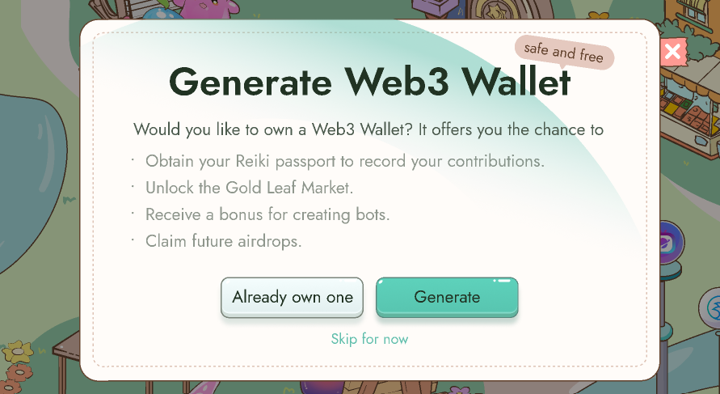

# Google Log in

Exciting news! We have introduced Gmail Log-in method for Reiki. Now, you can easily access your Reiki account by logging in with your Google email or Metamask wallet address.

<figure><figcaption></figcaption></figure>

If you have previously connected your email to Reiki and it is a Gmail account, you can directly log in using your Gmail. This way, all your previous data will automatically sync up.

If you have only connected your wallet and wish to log in using your Gmail account, follow these steps:

1. Go to the account settings page.
2. Add your Gmail account. Please note that the email address listed in your account settings is the one you should use for logging in.

<figure><figcaption></figcaption></figure>

If you log in through your Gmail account and are unfamiliar with wallet log-ins, welcome to the Web3 world! To connect your wallet, simply click on the "Connect" button on the account settings page and proceed to download Metamask. With wallet address, you can mint Reiki’s passport to unlock more gold leaves.

<figure><figcaption></figcaption></figure>

Please note that you can only connect to one wallet address, and it cannot be changed.

If you need any assistance, don't hesitate to join our [Discord](https://discord.com/invite/NTrHSqyuRg) channel. We are always ready to help!

