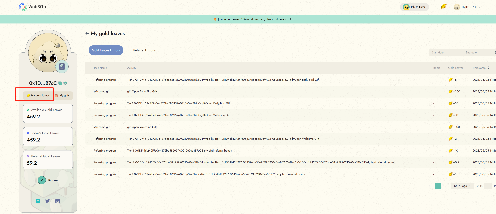
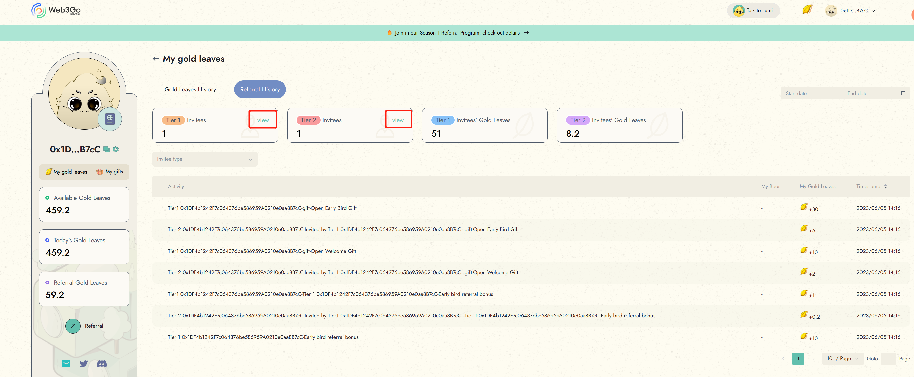
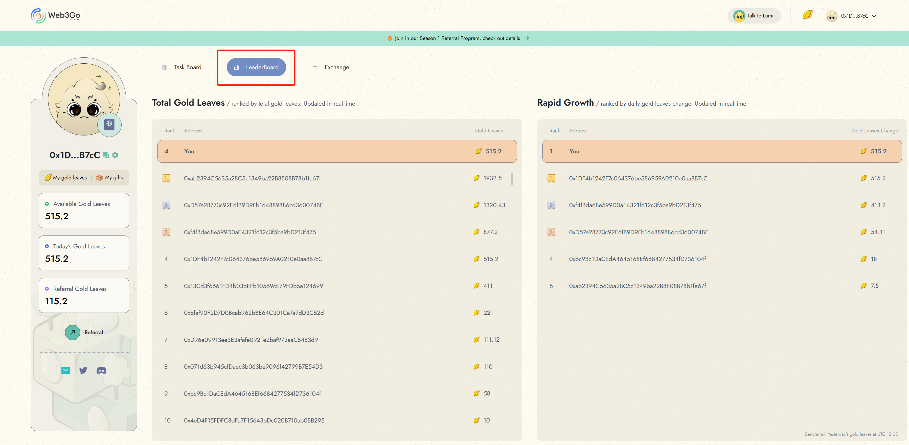

# Check Gold Leaves

#### View your gold leaves History

Click on the "My Gold Leaves" button to view your gold leaves balance and activity history.

<figure><figcaption></figcaption></figure>

#### View your referral activity

To view your referral activity, switch to the "Referral History" tab. Here, you will see the list of your Tier 1 and Tier 2 invitees along with their contribution to your gold leaves.

<figure><figcaption></figcaption></figure>

**View your rank**

To see your rank and growth among all users, click on the "Leaderboard" section. Here, you will see your current rank and the top users on the platform. You can also view their profiles to see how they collect their gold leaves and what tasks they have completed to earn rewards.

<figure><figcaption></figcaption></figure>

By following these steps, you can track your progress and see how you compare to other users on the platform. If you have any questions about your gold leaves or referral activity, please contact our [customer support team](../../support/external-links.md) for assistance.

