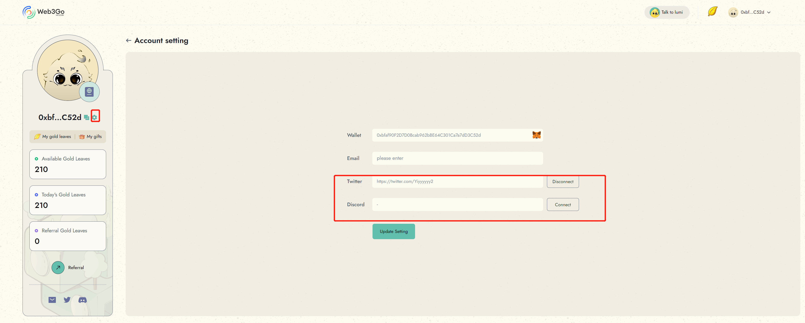
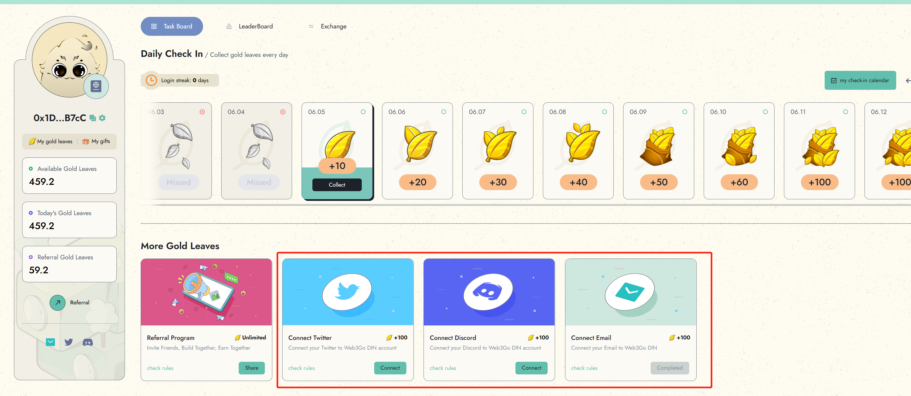
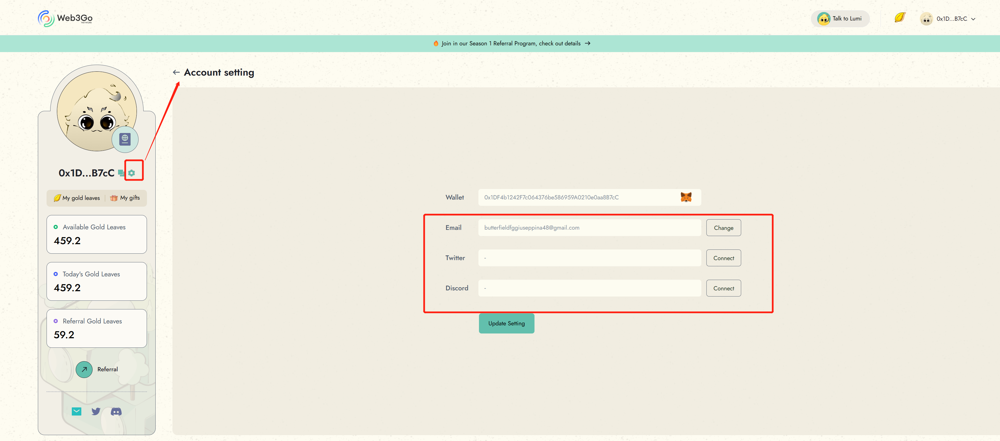

# Complete Profile

Connecting your social media accounts to your Reiki's Passport is a great way to earn gold leaves. Once you add your social media account to your passport, you will get gold leaves for each social media connection.&#x20;

Here are several ways to connect your social media accounts:

* Account Settings: To connect your social media accounts to your Reiki's Passport, navigate to the Account Settings module and follow the instructions provided.&#x20;

<figure><figcaption></figcaption></figure>

* Task Board: You can also connect your social media accounts by accessing the Task Board and completing the related tasks.&#x20;

<figure><figcaption></figcaption></figure>

* Early Bird Ticket Campaign: If you participated in the [Early Bird Ticket Campaign](https://analytix.web3go.xyz/warmup/), your social media account will be automatically connected to your Reiki's Passport, and the gold leaves will be added to your account automatically.

Once you have connected your social media accounts to your  Reiki's Passport, you will receive gold leaves for each connection. **Please note that this type of task can only earn gold leaves once.**

To view your connected social media accounts, simply connect to your wallet and navigate to your account setting page.

<figure><figcaption></figcaption></figure>

