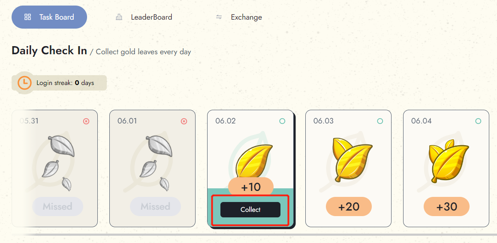

# Daily Check In

At Reiki, we reward our users for their engagement and participation on the platform. One way we do this is through our daily check-in rewards program.&#x20;

## How it works?

* Day 1: Receive 10 gold leaves for checking in.
* Day 2: Receive 20 gold leaves for checking in.
* Day 3: Receive 30 gold leaves for checking in.
* Day 4: Receive 40 gold leaves for checking in.
* Day 5: Receive 50 gold leaves for checking in.
* Day 6: Receive 60 gold leaves for checking in.
* Day 7: Receive 100 gold leaves for checking in.
* Continue to log in, keep receiving 100 gold leaves

If you continue to log in every day after that, you will keep receiving 100 gold leaves per day. However, if you miss a day of check-in, your log-in streak will reset to 1 day, and you will start receiving 10 gold leaves again on the next day you check in.

Checking in only takes one second per day, so why not start checking in today and collect your daily gold leaves? To participate in the check-in rewards program, simply connect to your wallet and click on the "Collect" button on Task Board

<figure><figcaption>
Tap "collect" every day 
</figcaption></figure>

