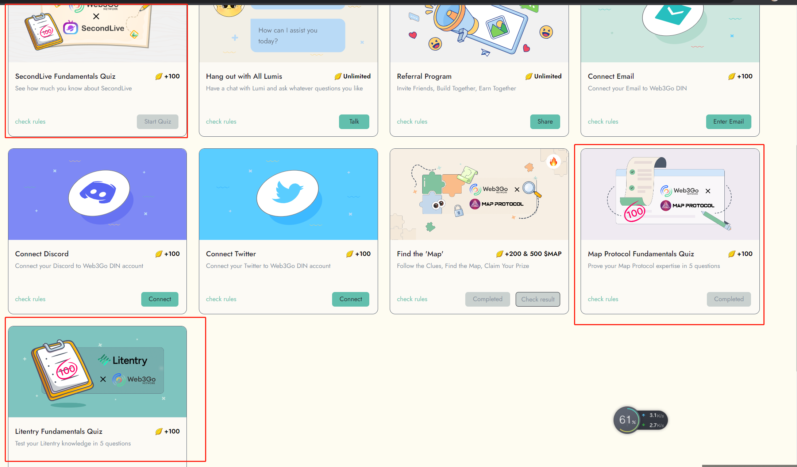

# Fundamentals Quiz

The 'Fundamentals Quiz' task enables you to test your knowledge by answering questions related to various Web3 projects. Here's how you can take the quiz:

1. Go to the task board and click on the "Take Quiz" button.
2. Answer all 5 questions in the quiz.
3. If you provide correct answers for all the questions, you will earn 100 gold leaves.

We hope you enjoy taking the quiz and find it helpful for testing your knowledge about several projects.&#x20;

We have already added Litentry, Map Protocol, SecondLive, Lifeform, Manta Network and Yuliverse to the 'Fundamentals Quiz' section. We plan to launch more quizzes about different projects in the future, so stay tuned!&#x20;

Good luck, and have fun testing your knowledge!

<figure><figcaption></figcaption></figure>

