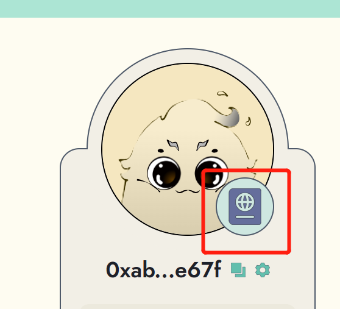

# Passport Attributes

Reiki's Passport contains several attributes that can help you earn more gold leaves and unlock new features on the platform. If you have participated in past campaigns, you may already have some great attributes that can give you a head start.&#x20;

To view your attributes, simply log in to your Reiki's account and check your passport.&#x20;

<figure><figcaption></figcaption></figure>

<figure><figcaption></figcaption></figure>

Here are some of the attributes that are currently available:

* **Web3go Ultimate MVB NFT:** If you have successfully obtained the Web3go Ultimate MVB NFT through related campaign, your gold leaves will be boosted by 15%.
* **Early Bird Ticket:** If you have participated Web3Go early bird campaign and successfully locked in an early bird ticket, your gold leaves will be boosted by 10%.
* **Referral boost:** Our referral program is currently in full swing. The more invitees you refer, the more boost you will receive. For more details about the referral program, please check <mark style="color:blue;">here.</mark>
* **Bot's Talking Power:** By default, bot's talking power will be at Level 0, which means you can have up to 10 free messages to talk to Lumi per day. However, you can exchange your gold leaves to level up Lumi's talking power and earn more available quota. For more deatils on how to level up Lumi's talking power, please check [here](https://www.notion.so/o/XD7t90Ngye0ozKIpZsk6/s/iDyiwvXZOK3AWrTTxKxX/user-guide/talk-to-lumi/boost-lumi-talking-power).
* **More boosts coming soon:** : As we continue to iterate our products, we will launch more boosts to reward members who actively participate in our activities. Please stay tuned for updates!
