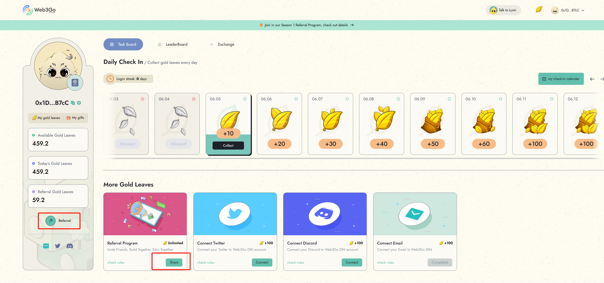
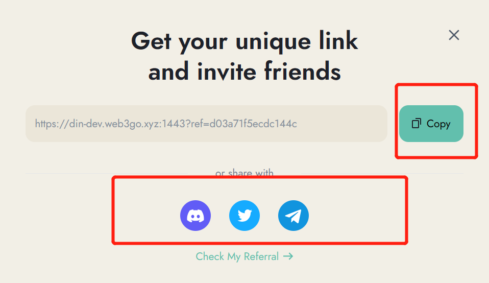

# Season 1 Referral Program

As a Reiki's passport holder, you are eligible to refer friends to the platform and earn rewards for their engagement.

## How it works?

Once your invitee has successfully minted their Reiki's Passport through your referral link, the referral relationship will be established between you and your invitee.&#x20;

From then on, every time your invitees collect gold leaves, Reiki will reward you with certain percentage of their collected gold leaves.

**Referral Tiers and Referral Reward Share**

Tier 1 referral: When you directly invite a friend to Reiki, you will be rewarded with 10% of their collected gold leaves every time they earn gold leaves.

Tier 2 referral: If your invitee invites their friends, you will be rewarded with 2% of their friends' collected gold leaves every time they earn gold leaves.

<figure><figcaption></figcaption></figure>

You can invite up to 10 friends, and the first 10 friends who become a Reiki's passport holder through your referral link  will be considered as your tier 1 invitees

Since you can invite up to 10 Tier 1 friends, which means you can invite up to 100 Tier 2 friends. In total, you can invite up to 110 friends.

**Referral Boosts**

To incentivize referrals even further, Reiki also launches a boost mechanism. In our referral program, you can receive a Referral boost, which offers a 1% boost for 0-50 invitees, a 2% boost for 50-100 invitees, and a 5% boost for over 100 invitees.

This boost is a incentive for you who bring in a significant number of referrals andwill enable you to earn rewards at an accelerated pace.

| Number of Invitees | Boost of Gold Leaves  |
| ------------------ | --------------------- |
| 0-50               | 1%                    |
| 50-100             | 2%                    |
| >100               | 5%                    |

**Early Bird Bonus**

If your tier 1 invitee comes from early bird campagin, you will receive 10 gold leaves for each redeemed referral.

## **How to do？**

To invite your friends to Reiki and earn referral rewards, follow these steps:

1. Connect to your wallet address and navigate to the Task Board module
2. Find the referral task or referral button and click on it to generate your unique referral link.

<figure><figcaption></figcaption></figure>

3. Copy the referral link provided.

<figure><figcaption></figcaption></figure>

4. Send the referral link to your friends through twitter, discord or any other social media
5. When your friends click on the referral link and successfully mint their Reiki's Passport, they will become your Tier 1 invitees, and you will start earning referral rewards.

