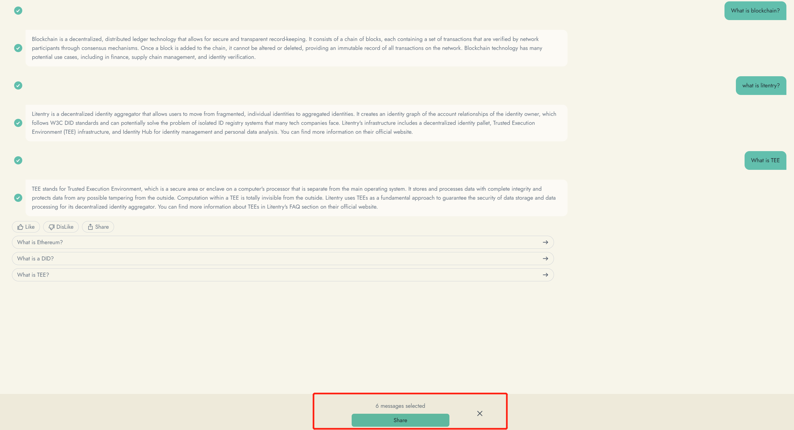

# My Chat

Introducing our new feature, "My Chat"! We've upgraded the previous "Talk to Lumi" to bring you a more immersive experience. With "My Chat," you can not only interact with Lumi but also access all your conversations with various bots in one place.

No more navigating through multiple screens or searching for specific interactions. "My Chat" consolidates all your bot conversations into a single, convenient interface. Whether you've chatted with Lumi or engaged with other AI companions, everything is easily accessible.

Enjoy the convenience of revisiting past conversations, reviewing shared information, and tracking your personal growth.&#x20;

####

#### Delete chat

Come to talk to them and give us some feedback through hitting on like and dislike.

<figure><figcaption></figcaption></figure>

Share bot&#x20;

If you loves to introduce your bot to your friend, please click the bot's name card and click share button

Share conversation

If you loves to share you conversation with any bot, please click share button and select the message you want to share

<figure><figcaption></figcaption></figure>

