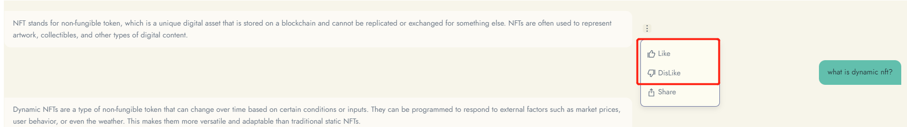

# Provide feedback

The "Providing Feedback" feature allows you to share your feedback on bot's responses, which helps creators improve the quality of their bots. Here's how you can provide feedback:

1. After receiving a response from bot, look for the thumbs-up and thumbs-down icons below the message.
2. If you liked bot's response, click on the thumbs-up icon to indicate your approval.
3. If you did not like bot's response, click on the thumbs-down icon to indicate your disapproval.

<figure><figcaption></figcaption></figure>

<figure><figcaption></figcaption></figure>

Your feedback is valuable to creators, and it will help creators improve bot's service and provide better responses in the future. We appreciate your time and effort in providing us with feedback.

