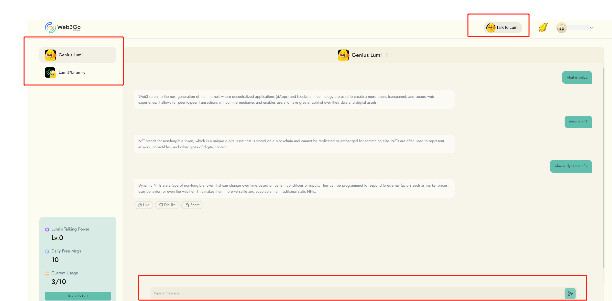

# Send Message

You can send messages to different bots on the "My Chat" page. Here's how you can do it:

1. Go to the "My Chat" page.
2. Select the bot you want to talk to.
3. Type your message in the input box.
4. Press the enter key or click the "Send" button to send your message.

<figure><figcaption></figcaption></figure>

Please note thatyour talking quota is currently limited. However, you can earn more gold leaves to boost your talking power and increase the quota.&#x20;

To learn how to boost Lumi's talking power, click [here](your-talking-power.md).

