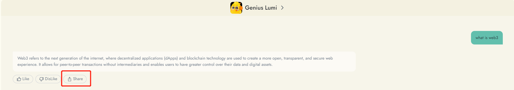
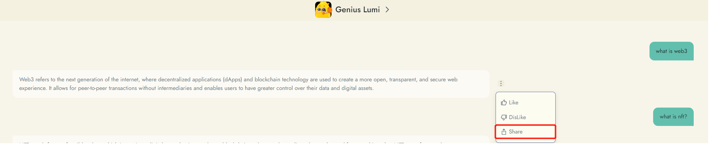
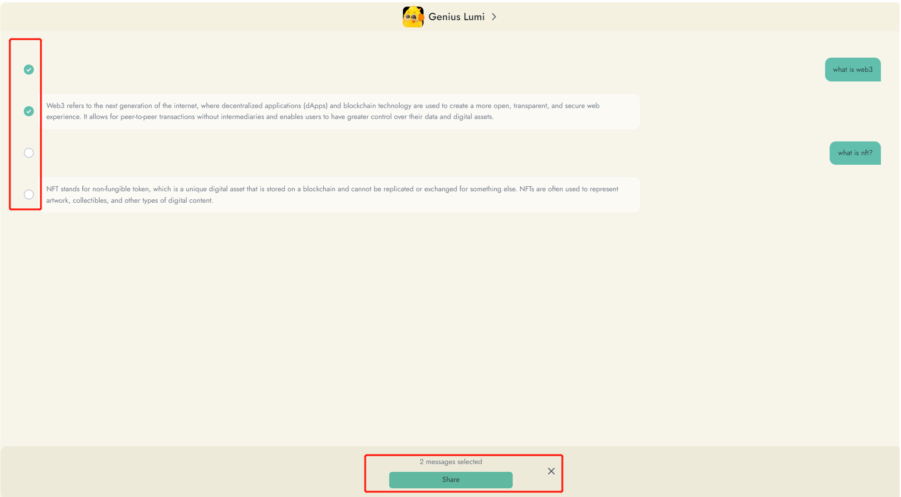
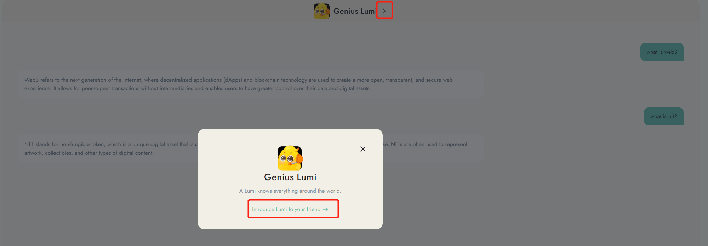

# Sharing and Introducing Bot

Reiki welcomes you to share your conversations with bot with others and introduce any bot you found interesting to your friends. Here's how you can do it:

#### Share Conversations:

1. If you find your conversation with any bot interesting, click the "Share" button. For historical conversations, the sharing button is hidden under the 'More' button.

<figure><figcaption></figcaption></figure>

<figure><figcaption></figcaption></figure>

2. Select the message you want to share.

<figure><figcaption></figcaption></figure>

2. Copy the link to share it or share it directly with your friends.
3. By sharing your conversation with any bot, you can earn 4 gold leaves per share, up to a maximum of 10 shares per day.

#### Introducing Bot to Friends:

1. Find bot's ID by clicking on the "Introduce Bot to your friend" button located on the conversation window.
2. Share bot's ID with your friends on social media or through other communication channels.
3. Spread the word about the bot and its helpful and cute features on Twitter.

<figure><figcaption></figcaption></figure>

