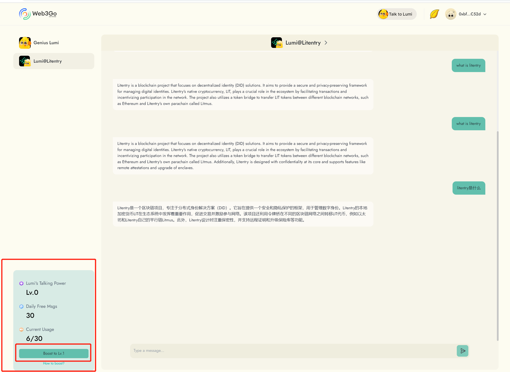
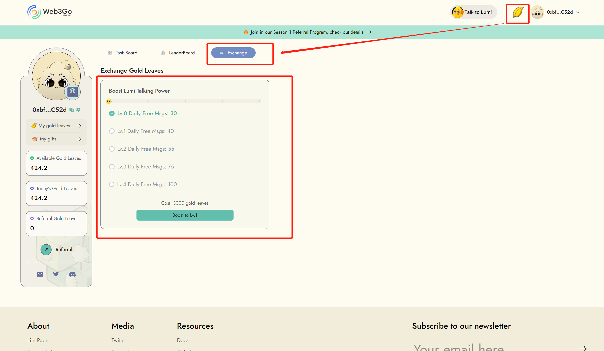

# Your Talking Power

Your talking power has five levels, each representing a different number of daily free messages you can talk to bot. You can boost your talking power to a higher level by exchanging gold leaves, with the number of gold leaves required varying depending on the level you want to achieve.

Here's a table showing the different levels of your talking power, along with the corresponding number of daily free messages and the cost in gold leaves to reach that level:

| Level | Daily Free Messages | Gold Leaves Required |
| ----- | ------------------- | -------------------- |
| 0     | 30                  | 0                    |
| 1     | 40                  | 3000                 |
| 2     | 55                  | 4000                 |
| 3     | 75                  | 5000                 |
| 4     | 100                 | 6000                 |

"To increase your talking power, simply navigate to the 'Boost Your Talking Power' section on the 'Exchange' page. Click the 'Boost' button and confirm the exchange, or directly boost by clicking the 'Boost' button in the bottom left corner on "my chat" page.

<figure><figcaption></figcaption></figure>

<figure><figcaption></figcaption></figure>

Once your Lumi talking power has been boosted, you will unlock more free messages and earn more gold leaves that will enhance your experience with Lumi. To earn more gold leaves so you can boost, please check more details [here](../gold-leaves-market/). Go to complete more tasks!

